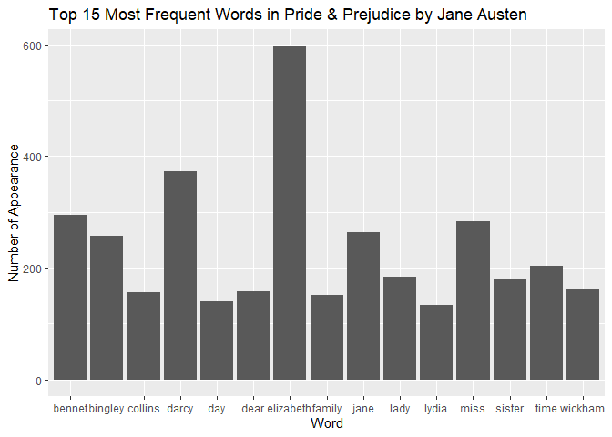
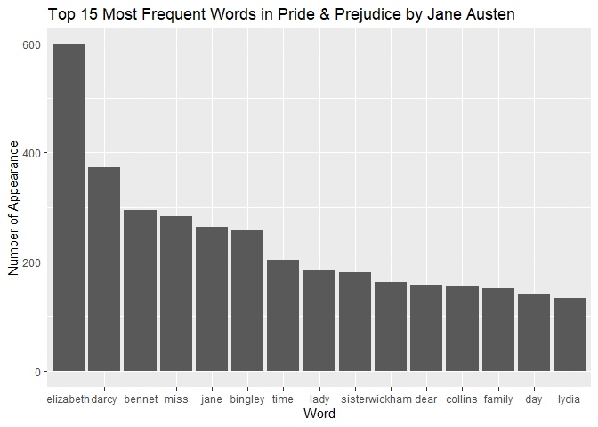

Assignment 4
================
Ivy Liu
2023-11-26

## Exercise 1: Common words in Jane Austen’s book

We will first load the required packages (notice that you need to
download the packages before running the following chunk).

``` r
library(ggplot2)
```

    ## Warning: 程辑包'ggplot2'是用R版本4.2.2 来建造的

``` r
library(dplyr)
```

    ## 
    ## 载入程辑包：'dplyr'

    ## The following objects are masked from 'package:stats':
    ## 
    ##     filter, lag

    ## The following objects are masked from 'package:base':
    ## 
    ##     intersect, setdiff, setequal, union

``` r
# load the Jane Austen book
library(janeaustenr)
```

    ## Warning: 程辑包'janeaustenr'是用R版本4.2.3 来建造的

``` r
# require stopwords from the following package
library(tidytext)
```

    ## Warning: 程辑包'tidytext'是用R版本4.2.3 来建造的

Next, we will be able to make a plot of the most common words in the
book after removing the pre-defined stopwords.

``` r
# load the stopwords
stopwords = tidytext::stop_words

# load Pride & Prejudice and remove the stopwords
pp = janeaustenr::austen_books() %>%
  filter(book == "Pride & Prejudice") %>%
  select(text) %>%
  unnest_tokens(word, text) %>%  # tokenize the text
  anti_join(stopwords, by = "word") # remove the stopwords

# find and plot the most common words 
pp %>%
  group_by(word) %>%
  summarize(count = n()) %>%
  arrange(desc(count)) %>%
  slice(1:15) %>%
  ggplot(aes(x = word, y = count)) +
  geom_col() +
  labs(title = "Top 15 Most Frequent Words in Pride & Prejudice by Jane Austen",
       x = "Word",
       y = "Number of Appearance")
```

<!-- -->

``` r
# Or instead, we can plot with descending appearance order
pp %>%
  group_by(word) %>%
  summarize(count = n()) %>%
  arrange(desc(count)) %>%
  slice(1:15) %>%
  ggplot(aes(x = reorder(word, desc(count)), y = count)) +
  geom_col() +
  labs(title = "Top 15 Most Frequent Words in Pride & Prejudice by Jane Austen",
       x = "Word",
       y = "Number of Appearance")
```

<!-- -->

## Exercise 2: Customized Pig Latin

Let’s first load the required packages.

``` r
library(testthat)
```

    ## Warning: 程辑包'testthat'是用R版本4.2.3 来建造的

    ## 
    ## 载入程辑包：'testthat'

    ## The following object is masked from 'package:dplyr':
    ## 
    ##     matches

Next, we define our customized Pig Latin through the following rules: 1.
If a word ends with a consonant or a consonant cluster, that consonant
or cluster is moved to the beginning of the word, and ‘oui’ is appended
to the end. 2. If a word ends with a vowel, ‘oui’ is appended to the
end.

``` r
#' Convert Words to Pig Latin
#'
#' This function takes English words and converts them to a customized version of Pig Latin.
#' The conversion rules are as follows:
#' - If a word ends with a consonant or a consonant cluster, that consonant or cluster is moved to the beginning of the word, and 'oui' is appended to the end.
#' - If a word ends with a vowel, 'oui' is appended to the end.
#'
#' @param word A character string representing a single English word.
#' @return A character string representing the Pig Latin version of the input word.
#' @export
#' @examples
#' my_pig_latin("hello")  # returns "hellooui"
#' my_pig_latin("apple")  # returns "appleoui"
#' my_pig_latin("string") # returns "ngstrioui"
#' @importFrom stringr str_detect
#' 
my_pig_latin <- function(words) {
  if (!is.character(words)) {
    stop("Input must be a character vector.")
  }
  
  convert_to_pig_latin <- function(word) {
    ends_in_vowel <- stringr::str_detect(word, "[aeiouAEIOU]$")
    
    if (ends_in_vowel) {
      return(paste0(word, "oui"))
    } else {
      consonant_cluster <- stringr::str_extract(word, "[^aeiouAEIOU]+$")
      return(paste0(consonant_cluster,
                    substring(word, 1, nchar(word)-nchar(consonant_cluster)),
                    "oui"))
    }
  }
  
  return(as.character(sapply(words, convert_to_pig_latin)))
}
```

Here shows a couple of examples.

``` r
# words that end in vowel
my_pig_latin(c("hello", "banana", "apple"))
```

    ## [1] "hellooui"  "bananaoui" "appleoui"

``` r
# words that end in consonant
my_pig_latin(c("mom", "dad", "sister", "brother"))
```

    ## [1] "mmooui"     "ddaoui"     "rsisteoui"  "rbrotheoui"

``` r
# mixing words
my_pig_latin(stopwords$word[1:10])
```

    ##  [1] "aoui"           "'saoui"         "ableoui"        "tabououi"      
    ##  [5] "aboveoui"       "ngaccordioui"   "nglyaccordioui" "ssacrooui"     
    ##  [9] "llyactuaoui"    "rafteoui"

In the following chunk, we test the pig latin function.

``` r
test_that("Test cases", {
  # Tests with errors
  expect_error(my_pig_latin(545),
               "Input must be a character vector.")
  # tests with vowel-ending words
  expect_equal(my_pig_latin(c("hello", "banana", "apple")),
               c("hellooui",  "bananaoui", "appleoui" ))
  # tests with words that end in consonant or consonant cluster
  expect_equal(my_pig_latin(c("austen", "chapter", "truth")),
               c("nausteoui",  "rchapteoui", "thtruoui" ))
  # test with mixing words
  expect_equal(my_pig_latin(c("austen", "jane")),
               c("nausteoui",  "janeoui" ))
})
```

    ## Test passed 🥇
